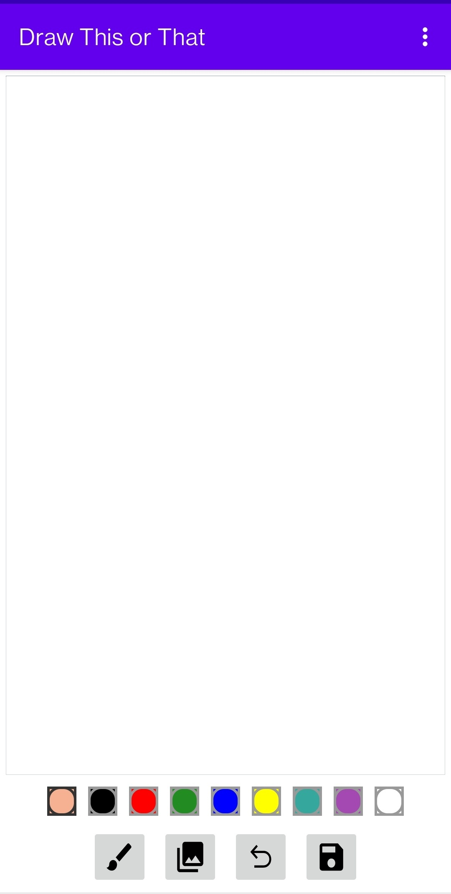
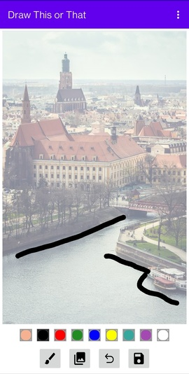
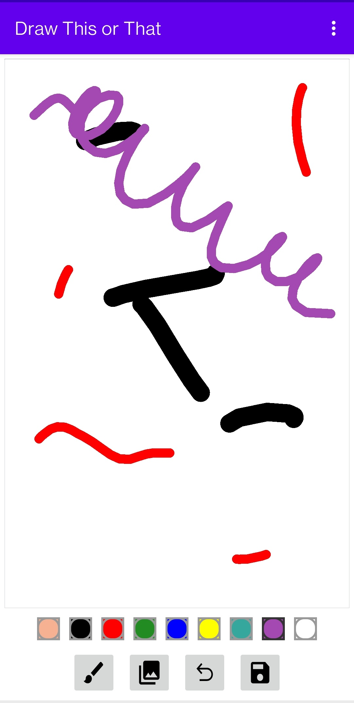

# Draw This Or That

This is a simple and no-fuss app to draw or sketch in black and white, or colour. 
Add a background image and draw over it to make it more interesting and customised.
[View on Google Play](https://play.google.com/store/apps/details?id=com.pkndegwa.drawthisorthat)

### Features
- Select different brush thickness
- Select different colour from a palette
- Undo brush strokes
- Save and share your drawings

### Screenshots
&nbsp;
&nbsp;
&nbsp;

## Getting Started

These instructions will give you a copy of the project up and running on
your local machine for development and testing purposes.

### Prerequisites

Requirements for the software and other tools to build, test and push 
- [Android Studio](https://developer.android.com/studio)
- [JDK] (https://www.oracle.com/java/technologies/downloads/)
- [Gradle Build Tool](https://gradle.org/) installed in your IDE.

### Installing and Deployment

1. Download the repository to your computer or use Git to clone it.
2. Open the project in Android Studio.
3. Build the project using Gradle.
4. Install the app on your device or run it in an emulator.

## Built With

  - Android Studio
  - Kotlin

## License

This project is licensed under the CC0 1.0 Universal 
[Creative Commons License](https://creativecommons.org/publicdomain/zero/1.0/).

## Acknowledgments

The Complete Android 12 & Kotlin Development Masterclass on Udemy
created by Denis Panjuta & Tutorials.eu.
See the course [here](https://www.udemy.com/course/android-kotlin-developer/).

